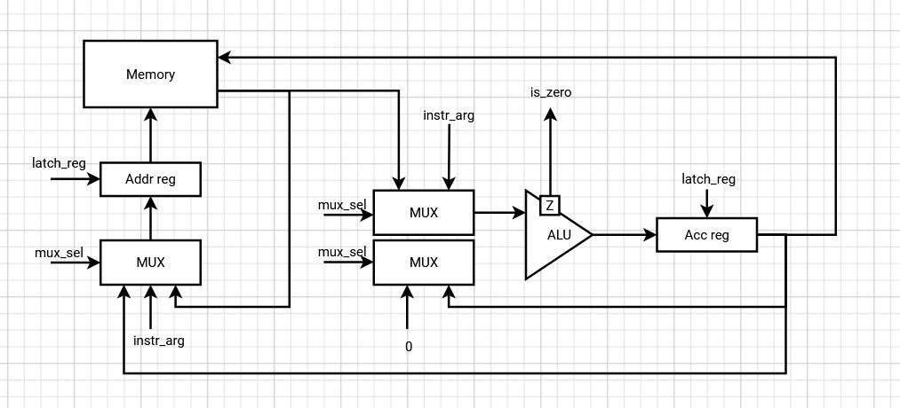
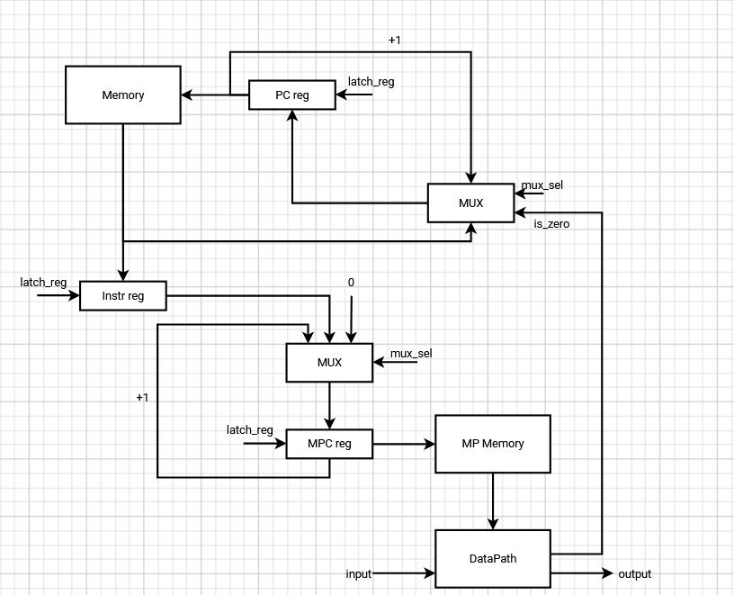

# Архитектура компьютера. Лабораторная работа 3

- Козак Борис Павлович, P3221
- `asm | acc | neum | mc | instr | struct | stream | mem | cstr | prob1`
- Базовый вариант

## Язык программирования

```ebnf
program ::= [data_part] [code_part]

data_part ::= ".data:" [comment] "\n" {data_line} 

data_line ::= name data [comment] "\n"

data ::= "INT" number 
       | "STR" string
       | "BUF" number

code_part ::= ".code:" [comment] "\n" {code_line}

code_line ::= label [comment]
            | instr [comment]
            | [comment] "\n"
        
label ::= name ":" "\n"

instr ::= op0
        | op1
    
op0 ::= "HLT"
      | "INP"
      | "OUT"
  
op1 ::= "JMP" name
      | "JZ" name
      | "PUSH" name 
      | "PUSH" number
      | "LOAD" name 
      | "SAVE" name 
      | "LLOAD" name 
      | "SSAVE" name 
      | "ADD" number
      | "MOD" number
      | "ADDM" name
    
comment ::= ";" {<any except "\n">}

number ::= ["-"] { <any of "0-9"> }

name ::= <any of "a-z A-Z _"> { <any of "a-z A-Z 0-9 _"> }

string ::= '"' {<any except "\n" ";">} '"'
```

_Операции потока программы_

- `HLT` - стоп программы
- `JMP` - перейти к метке (адресу памяти)
- `JZ` - перейти к метке (адресу памяти), если установлен флаг `zero`

_Операции работы с аккумулятором_

- `PUSH` - загрузить в аккумулятор значение (например, если указать имя переменной, то это загрузит её адрес)
- `LOAD` - загрузить значение в аккумулятор по адресу памяти
- `SAVE` - сохранить значение из аккумулятора по адресу памяти
- `LLOAD` - загрузить значение в аккумулятор по адресу, который лежит в памяти
- `SSAVE` - сохранить значение из аккумулятора по адресу, который лежит в памяти

_Арифметические операции_

- `ADD` - прибавить значение к аккумулятору
- `MOD` - найти остаток от деления значения в аккумуляторе на переданное значение
- `ADDM` - прибавить значение, которое лежит в памяти, к аккумулятору

_Операции работы с I\O_

- `INP` - ввести значение извне в аккумулятор
- `OUT` - вывести значение из аккумулятора

_Типы данных_

- `STR` - нул-терминированная строка
- `BUF` - буфер заполненный нулями
- `INT` - целое число

_Особенности:

- Код выполняется последовательно
- При трансляции все метки в коде заменяются на соответствующие адреса
- Память выделяется и заполняется начальными значениями статически при запуске модели
- Видимость данных - глобальная
- Литералы:
  - Целое число
  - Строка

## Организация памяти

Модель памяти процессора:

- Архитектура фон Неймана - память данных и память команд
  - Сначала идут инструкции, потом данные
- Память:
  - Машинное слово - не определено, один словарь вида `{"index: 0, "opcode": "op", "arg": 0}`
  - Линейное адресное пространство
  - Реализуется списком целых чисел
- Память микрокоманд:
  - Машинное слово - количество видов сигналов
  - Линейное адресное пространство
  - Реализуется списком списков активных сигналов
- Адресация абсолютная (`JMP` `JZ`)
- Прямая загрузка (`PUSH`)
- Управление процессором осуществляется с помощью микрокода

Модель памяти:

- При запуске программы память выделяется статически и разделена на память данных + команд и память микрокоманд
- Система команд построена вокруг аккумулятора
- Все регистры (кроме аккумулятора) вспомогательные и прямого доступа у программиста к ним нет
- Можно осуществлять чтение и запись в память через регистр `Addr_reg`
- Инструкции и подпрограммы хранятся в памяти с остальными инструкциями

```text
          Registers
+------------------------------+
| acc                          |
+------------------------------+
       Instruction memory
+------------------------------+
| 00  : program start          |
| 01  : instruction            |
|    ...                       |
|  n  : HLT                    |
| n+1 : value                  |
| n+2 : value                  |
|    ...                       |
| l+0 : string value           |
| l+1 : \0                     |
|    ...                       |
| c+0 : buffer \0              |
| c+1 : buffer \0              |
|    ...                       |
+------------------------------+

       Microprogram memory
+------------------------------+
| 00  : Signals                |
| 01  : Signals                |
|    ...                       |            
+------------------------------+
```

- Литералы загружаются в аккумулятор с помощью `PUSH`, `LOAD`, `LLOAD`
- Литералы изначально находятся в статической памяти, если объявлены в разделе `.data`
  - Порядок такой же как при объявлении
- Строки хранятся по символу в машинном слове, конец строки обозначается с помощью `\0`
- Констант нет
- Инструкции не защищены от изменения после компиляции программы и загрузки их в память
- Переход к следующей инструкции осуществляется
  - Последовательно
  - Безусловно - `JMP`
  - Условно -`JZ`

## Система команд

Особенности процессора

- Машинное слово - 32 бита, знаковое. Только абсолютная адресация
- Все данные представлены целым числом, поэтому с ними можно работать как с числом
- Регистры, кроме аккумулятора, не доступны для программиста
  - `pc_reg` - хранит указатель на следующую инструкцию
  - `instr_reg` - хранит текущую инструкцию
  - `mpc_reg` - хранит указатель на текущую микропрограмму
  - `addr_reg` - указатель на ячейку памяти данных
  - `acc_reg` - аккумулятор
- Доступ к памяти данных осуществляется по адресу, хранящемуся в специальном регистре `addr_reg`
- Обработка данных:
  - Арифметические операции с аккумулятором
  - Операциями ввода/вывода
- Ввод/вывод происходит через аккумулятор с определенными ячейками в памяти
  - Маппинг портов определяется `INP_PORT`, `OUT_PORT` в модуле [op.py](op.py)
- Поток управления:
  - Автоинкремент `Program counter`
  - Безусловный переход - `JMP`
  - Условный переход - `JZ`, если установлен флаг `zero`
  - `HLT` - остановка программы

### Набор инструкций

Все инструкции языка напрямую отображаются в инструкции процессора, за исключением инструкций выделения памяти для
данных

Каждая инструкция начинается с выборки инструкции (2 такта)

Обозначения:

- M - memory
- AD - addr_reg
- ACC - acc_reg
- MPC - mpc_reg
- PC - pc_reg
- Z - zero flag

Инструкции управления потоком программы

| Инструкция | Кол-во тактов | Описание                         |
| -------------------- | :----------------------: | ---------------------------------------- |
| `HLT`              |            1            | Остановка программы    |
| `JMP` [addr]       |            1            | MPC = 0, PC = IR                         |
| `JZ` [addr]        |            1            | MPC = 0, IF Z: PC = IR ELSE: PC = PC + 1 |

Инструкции работы с аккумулятором

| Инструкция | Кол-во тактов | Описание                                       |
| -------------------- | :----------------------: | ------------------------------------------------------ |
| `PUSH` [value]     |            1            | MPC = 0, ACC = IR, PC = PC + 1                         |
| `LOAD`             |            2            | MPC = 0, AR = IR, ACC = M[AR], PC = PC + 1             |
| `SAVE`             |            2            | MPC = 0, AR = IR, M[AR] = ACC, PC = PC + 1             |
| `LLOAD`            |            3            | MPC = 0, AR = IR, AR = M[AR], ACC = M[AR], PC = PC + 1 |
| `SSAVE`            |            3            | MPC = 0, AR = IR, AR = M[AR], M[AR] = ACC, PC = PC + 1 |

Инструкции арифметики

| Инструкция | Кол-во тактов | Описание                                 |
| -------------------- | :----------------------: | ------------------------------------------------ |
| `ADD`              |            1            | MPC = 0, ACC = ACC + IR, PC = PC + 1             |
| `MOD`              |            1            | MPC = 0, ACC = ACC % IR, PC = PC + 1             |
| `ADD`              |            2            | MPC = 0, AR = IR, ACC = ACC + M[AR], PC = PC + 1 |

Вспомогательные инструкции

| Инструкция  | Кол-во тактов | Описание          |
| --------------------- | :----------------------: | ------------------------- |
| `INSTRUCTION_FETCH` |            2            | IR = PM[PC], MPC = ID[IR] |

### Кодирование инструкций

- Машинный код в виде словарей `{"index: 0, "opcode": "op", "arg": 0}`
- Все инструкции данных заменяются на соответсвующее данные
- Вместо меток подставляется адрес в памяти команд

Пример:

```
[{"index": 0, "opcode": "LOAD", "arg": 0},
 {"index": 1, "opcode": "JZ", "arg": 4},
 {"index": 2, "opcode": "SAVE", "arg": 1},
 {"index": 3, "opcode": "JMP", "arg": 0},
 {"index": 4, "opcode": "HLT", "arg": null},
 {"index": 5, "opcode": "INT", "arg": 0},
 {"index": 6, "opcode": "INT", "arg": 0}]
```

В модуле [op.py](op.py) тип данных `Opcode` - перечисление кодов операций

### Память микрокоманд

Память микрокоманд реализована в модуле [microprogram.py](microprogram.py)

- Представляет собой список активных управляющих сигналов каждый тик процессора
- Память микрокоманд начинается с последовательности сигналов выборки инструкции (находится по нулевому адресу в память
  микрокоманд)
- Метод `opcode_to_mp` отображает `Opcode` команд в соответсвующий адрес в памяти микрокоманд

Память микрокоманд в виде списка активных сигналов - `memory` в модуле [microprogram.py](microprogram.py)

Сигналы определены в `MP` в модуле [microprogram.py](microprogram.py)

- `LATCH_*` - защелкнуть регистр
- `MUX_*` - управляющий сигнал на MUX
- `ALU_*` - выбор операции АЛУ
- `OE` - чтение
- `WE` - запись
- `IO` - сигнал к портам ввода/вывода
- `HALT` - остановка программы

## Транслятор

Интерфейс командной строки:

```
usage: python translator.py [-h] source_file target_file
                                             
Трансляция кода                              
                                             
positional arguments:                        
  source_file  Имя файла с кодом             
  target_file  Имя выходного файла

options:
  -h, --help   show this help message and exit 
```

Реализовано в модуле [translator.py](./translator.py)

Принципы работы:

- Пустые строки или только с комментариями пропускаются
- Комментарии в строках отсекаются
- Два прохода: разделение на токены и отображение в машинный код
- Отдельная обработка сначала `.data`, потом `.code`
- `.data`:
  - Замена на данные по типу данных
    - `INT` - число по значению
    - `STR` - каждый символ = одно машинное слово, заканчивается `\0`
    - `BUF` - заменяется на n `\0`
  - Сохранение адреса переменной для последующей замены обращений по имени
- `.code`
  - Если оканчивается на `:` - метка, сохраняется адрес для последующей замены обращений по имени
  - Иначе инструкция прямо отображается в машинный код
  - `INP` - заменяется на `LOAD`
  - `OUT` - заменяется на `SAVE`
- Инструкции и данные объединяются в один список (сначала инструкции, потом данные)

## Модель процессора

Интерфейс командной строки:

```
usage: python simulator.py [-h] [--debug_limit DEBUG_LIMIT] [--limit LIMIT] code_file [input_file]

Симуляция процессора

positional arguments:
  code_file             Имя файла бинарным с кодом
  input_file            Имя входного файла (опционально)

options:
  -h, --help            show this help message and exit
  --debug_limit DEBUG_LIMIT
                        Лимит отладки (по умолчанию 200)
  --limit LIMIT         Лимит тиков (по умолчанию 100000)
```

Реализован в модуле: [simulator.py](simulator.py)

- Микропрограммное управление
- Аккумуляторная архитектура

Особенности работы модели:

- Подготовка и запуск модели происходит в методе `simulation` в модуле [simulator.py](simulator.py)
- Шаг моделирования равен одному тику процессора
- Для журнала состояний процессора используется стандартный модуль `logging`
  - Текущая инструкция
  - Текущий тик
  - Состояние регистров
- Количество инструкций для моделирования и логирования лимитировано
- Остановка моделирования осуществляется при:
  - Превышении лимита количества выполняемых инструкций;
  - Исключении `StopIteration` -- если выполнена инструкция `HLT`.

### DataPath



Реализован в классе `DataPath` в модуле [datapath.py](datapath.py)

- Все сигналы описаны в модуле [microprogram.py](microprogram.py), реализованы в виде методов класса
- Управляющие сигналы приходят из памяти микрокоманд
- `Memory` - однопортовая память: либо читаем, либо пишем
- `ALU` - АЛУ для выполнения арифметических операций
- `Addr_reg` - указатель на данные
- `Acc_reg` - аккумулятор
- `input`/`output` - порты ввода/вывода

Сигналы:

- `latch_*` - защёлкнуть соответствующий регистр
- `sel_*` - выбрать значение на соответсвующее мультиплексоре

Флаги:

- `zero` - для проверки на ноль

### ControlUnit



Реализован в классе `ControlUnit` в модуле [control_unit.py](control_unit.py)

- Все сигналы описаны в модуле [microprogram.py](microprogram.py), реализованы в виде методов класса
- Управляющие сигналы приходят из памяти микрокоманд
- Цикл процессора реализован в методе `decode_and_execute`
  1. Получение сигналов из памяти микрокоманд
  2. Выполнение сигналов
  3. Тик
- `Memory` - только читаем
- `Pc_reg` - указатель на следующую инструкцию
- `Instr_reg` - хранит текущую инструкцию
- `Mpc_reg` - счетчик микрокоманд
  - `MP_memory` - память микрокоманд
- `input`/`output` - порты ввода/вывода

Сигналы:

- `latch_*` - защёлкнуть соответствующий регистр
- `sel_*` - выбрать значение на соответсвующее мультиплексоре

## Тестирование

Тестирование выполняется при помощи golden test-ов

- Реализованные программы лежат в [assembly](assembly)
- Предлагаемые входные данные лежат в [inp](inp)
- Конфигурации golden test-ов лежат в [testing](testing) в виде файлов формата _.yml_
  - Код программы
  - Входные данные
  - Машинный код
  - Выходные данные
  - Журнал работы процессора

Алгоритмы:

- [cat](testing/test_cat.yml) - вывод потенциально бесконечных входных данных
- [hello](testing/test_hello.yml) - вывод сообщения
- [username](testing/test_username.yml) - вывод приветствия пользователя с учетов ввода
- [prob1](testing/test_prob1.yml) - алгоритм на работу с числами

Запустить тесты: `poetry run pytest . -v`

Обновить конфигурацию golden tests: `poetry run pytest . -v --update-goldens`

Разбор теста `hello` ([hello](testing/test_hello.yml))

- Код программы

```text
.data:                  ; обозначаем начало раздела данных
    STR hello "Hello!"  ; объявляем переменную `hello` типа данных `STR` со значением `Hello!`
    INT index 0

.code:                  ; обозначаем начало раздела кода
    PUSH hello          ; загружаем адрес переменной `hello` в аккумулятор
    SAVE index          ; сохраняем значение из аккумулятора в переменную `index`

print:                  ; метка `print`
    LLOAD index         ; загружаем значение из памяти по адресу из переменной `index` в аккумулятор
    JZ hlt              ; если в аккумуляторе `\0` (конец строки), то переходим к метке `hlt`
    OUT                 ; выводим значение из аккумулятора на порт вывода
    LOAD index          ; загружаем значение переменной `index` в аккумулятор
    ADD 1               ; инкрементируем значение в аккумуляторе
    SAVE index          ; сохраняем значение из аккумулятора в переменную `index`
    JMP print           ; переходим к метке `print`

hlt:                    ; метка `hlt`
    HLT                 ; остановка работы программы
```

- Вывод транслятора

```
		python .\translator.py .\assembly\hello.asm .\translated\hello.output
LoC: 20 Instr: 20
```

- Машинный код (до перевода в бинарный формат)

```
[{"index": 0, "opcode": "PUSH", "arg": 12},
 {"index": 1, "opcode": "SAVE", "arg": 19},
 {"index": 2, "opcode": "LLOAD", "arg": 19},
 {"index": 3, "opcode": "JZ", "arg": 9},
 {"index": 4, "opcode": "SAVE", "arg": 1},
 {"index": 5, "opcode": "LOAD", "arg": 19},
 {"index": 6, "opcode": "ADD", "arg": 1},
 {"index": 7, "opcode": "SAVE", "arg": 19},
 {"index": 8, "opcode": "JMP", "arg": 2},
 {"index": 9, "opcode": "HLT", "arg": null},
 {"index": 10, "opcode": "INT", "arg": 0},
 {"index": 11, "opcode": "INT", "arg": 0},
 {"index": 12, "opcode": "STR", "arg": 72},
 {"index": 13, "opcode": "STR", "arg": 101},
 {"index": 14, "opcode": "STR", "arg": 108},
 {"index": 15, "opcode": "STR", "arg": 108},
 {"index": 16, "opcode": "STR", "arg": 111},
 {"index": 17, "opcode": "STR", "arg": 33},
 {"index": 18, "opcode": "STR", "arg": 0},
 {"index": 19, "opcode": "INT", "arg": 0}]
```

- Вывод процессора (логирование уровня INFO)

```
python .\simulator.py .\translated\hello.output .\inp\t.txt
INFO:root:Start simulation
INFO:root:output_buffer: Hello!
INFO:root:End simulation
Hello!
Instructions: 47 Ticks: 173
```

- Журнал работы, логирование уровня DEBUG (часть)

```
python .\simulator.py .\translated\hello.output .\inp\t.txt            
INFO:root:Start simulation
DEBUG:root:TICK:   1 PUSH   PC:   0 MPC:  1 AR:   0 ACC:   0 
DEBUG:root:TICK:   2 PUSH   PC:   0 MPC: 19 AR:   0 ACC:   0 
DEBUG:root:TICK:   3 PUSH   PC:   1 MPC:  0 AR:   0 ACC:  12 
DEBUG:root:TICK:   4 SAVE   PC:   1 MPC:  1 AR:   0 ACC:  12 
DEBUG:root:TICK:   5 SAVE   PC:   1 MPC:  7 AR:   0 ACC:  12 
DEBUG:root:TICK:   6 SAVE   PC:   1 MPC:  8 AR:  19 ACC:  12
DEBUG:root:TICK:   7 SAVE   PC:   2 MPC:  0 AR:  19 ACC:  12
DEBUG:root:TICK:   8 LLOAD  PC:   2 MPC:  1 AR:  19 ACC:  12
DEBUG:root:TICK:   9 LLOAD  PC:   2 MPC:  9 AR:  19 ACC:  12
DEBUG:root:TICK:  10 LLOAD  PC:   2 MPC: 10 AR:  19 ACC:  12
DEBUG:root:TICK:  11 LLOAD  PC:   2 MPC: 11 AR:  12 ACC:  12
DEBUG:root:TICK:  12 LLOAD  PC:   3 MPC:  0 AR:  12 ACC:  72
DEBUG:root:TICK:  13 JZ     PC:   3 MPC:  1 AR:  12 ACC:  72
DEBUG:root:TICK:  14 JZ     PC:   3 MPC:  3 AR:  12 ACC:  72
DEBUG:root:TICK:  15 JZ     PC:   4 MPC:  0 AR:  12 ACC:  72
DEBUG:root:TICK:  16 SAVE   PC:   4 MPC:  1 AR:  12 ACC:  72
DEBUG:root:TICK:  17 SAVE   PC:   4 MPC:  7 AR:  12 ACC:  72
DEBUG:root:TICK:  18 SAVE   PC:   4 MPC:  8 AR:   1 ACC:  72
DEBUG:root:output: H << 72
DEBUG:root:TICK:  19 SAVE   PC:   5 MPC:  0 AR:   1 ACC:  72
DEBUG:root:TICK:  20 LOAD   PC:   5 MPC:  1 AR:   1 ACC:  72
DEBUG:root:TICK:  21 LOAD   PC:   5 MPC:  5 AR:   1 ACC:  72
DEBUG:root:TICK:  22 LOAD   PC:   5 MPC:  6 AR:  19 ACC:  72
DEBUG:root:TICK:  23 LOAD   PC:   6 MPC:  0 AR:  19 ACC:  12
DEBUG:root:TICK:  24 ADD    PC:   6 MPC:  1 AR:  19 ACC:  12
DEBUG:root:TICK:  25 ADD    PC:   6 MPC: 15 AR:  19 ACC:  12
DEBUG:root:TICK:  26 ADD    PC:   7 MPC:  0 AR:  19 ACC:  13
DEBUG:root:TICK:  27 SAVE   PC:   7 MPC:  1 AR:  19 ACC:  13
DEBUG:root:TICK:  28 SAVE   PC:   7 MPC:  7 AR:  19 ACC:  13
DEBUG:root:TICK:  29 SAVE   PC:   7 MPC:  8 AR:  19 ACC:  13
DEBUG:root:TICK:  30 SAVE   PC:   8 MPC:  0 AR:  19 ACC:  13
DEBUG:root:TICK:  31 JMP    PC:   8 MPC:  1 AR:  19 ACC:  13
DEBUG:root:TICK:  32 JMP    PC:   8 MPC:  2 AR:  19 ACC:  13
DEBUG:root:TICK:  33 JMP    PC:   2 MPC:  0 AR:  19 ACC:  13
DEBUG:root:TICK:  34 LLOAD  PC:   2 MPC:  1 AR:  19 ACC:  13
DEBUG:root:TICK:  35 LLOAD  PC:   2 MPC:  9 AR:  19 ACC:  13
DEBUG:root:TICK:  36 LLOAD  PC:   2 MPC: 10 AR:  19 ACC:  13
DEBUG:root:TICK:  37 LLOAD  PC:   2 MPC: 11 AR:  13 ACC:  13
DEBUG:root:TICK:  38 LLOAD  PC:   3 MPC:  0 AR:  13 ACC: 101
DEBUG:root:TICK:  39 JZ     PC:   3 MPC:  1 AR:  13 ACC: 101
DEBUG:root:TICK:  40 JZ     PC:   3 MPC:  3 AR:  13 ACC: 101
DEBUG:root:TICK:  41 JZ     PC:   4 MPC:  0 AR:  13 ACC: 101
DEBUG:root:TICK:  42 SAVE   PC:   4 MPC:  1 AR:  13 ACC: 101
DEBUG:root:TICK:  43 SAVE   PC:   4 MPC:  7 AR:  13 ACC: 101
DEBUG:root:TICK:  44 SAVE   PC:   4 MPC:  8 AR:   1 ACC: 101
DEBUG:root:output: He << 101
DEBUG:root:TICK:  45 SAVE   PC:   5 MPC:  0 AR:   1 ACC: 101
DEBUG:root:TICK:  46 LOAD   PC:   5 MPC:  1 AR:   1 ACC: 101
DEBUG:root:TICK:  47 LOAD   PC:   5 MPC:  5 AR:   1 ACC: 101
DEBUG:root:TICK:  48 LOAD   PC:   5 MPC:  6 AR:  19 ACC: 101
DEBUG:root:TICK:  49 LOAD   PC:   6 MPC:  0 AR:  19 ACC:  13
DEBUG:root:TICK:  50 ADD    PC:   6 MPC:  1 AR:  19 ACC:  13
```

### CI

CI при помощи Github Action

[python.yml](./.github/workflows/python.yml)

- `poetry` - управления зависимостями для языка программирования Python.
- `coverage` - формирование отчёта об уровне покрытия исходного кода.
- `pytest` - утилита для запуска тестов.
- `ruff` - утилита для форматирования и проверки стиля кодирования.

Запускается при пуше в репозиторий на ветку мастер
Тестовые процессы

- `test` - запуск тестов
- `lint` - запуск линтера

### Для сбора аналитики

| ФИО                                 | алг          | LoC | code байт | code инстр. | инстр. | такт. | вариант                                                           |
| :------------------------------------- | :-------------- | :-- | :------------ | :--------------- | :---------- | :-------- | :----------------------------------------------------------------------- |
| Козак Борис Павлович | cat             | 10  | -             | 7                | 216         | 800       | `asm - acc - neum - mc - instr - struct - stream - mem - cstr - prob1` |
| Козак Борис Павлович | hello           | 20  | -             | 20               | 47          | 173       | `asm - acc - neum - mc - instr - struct - stream - mem - cstr - prob1` |
| Козак Борис Павлович | hello_user_name | 46  | -             | 69               | 202         | 748       | `asm - acc - neum - mc - instr - struct - stream - mem - cstr - prob1` |
